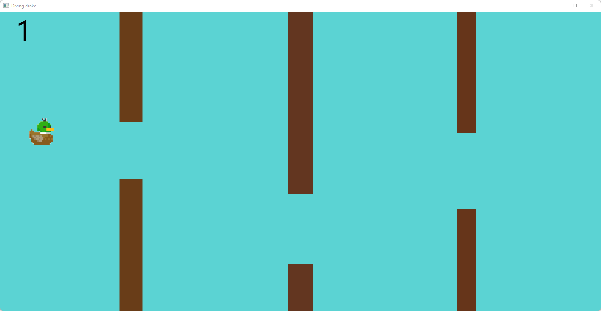

# Diving Drake

## Description
This is a tiny **java-fx** application that was inspired by the famous game flappy bird. 
The drake has to swim against a hefty wind blowing from the north and has to care not to float off the map. 
The drake is following the stream down the river, but must avoid logs crossing his way. 
The longer the drake can swim without colliding with an obstacle, the more *frequently* obstacles will spawn 
and also *move faster*.  
This game has **no ending**; when the drake collides with an obstacle, the score will be *reset* 
(and so will the speed and the spawning time of the obstacles).

The drake can swim upwards by pressing "w" and downwards by pressing "s".

## Sources
Code base from:
https://github.com/Da9el00/FlappyBirdJavaFX

Drake image:
https://destin.itch.io/drake

Rock image:
https://toppng.com/show_download/226268/rock-rock-pixel-art

Sounds:
https://freesound.org/

### Own contributions
- modified view
- added an image for the drake
- added moving up and down for the drake
- added randomized shade of brown for colored logs
- added randomized width of logs
- added increasing moving speed of the obstacles 
- added increasing spawning speed of the obstacles 
- added swim sound
- added collision sound (incl playing limiter)
- added southern vertical map bound for drake
- added rocks
- added image for rocks
- added time interval after reset until increasing the score again
- added time interval for moving the drake
- added comments for most of the code
- added pause / unpause function to gameloop
- removed unnecessary features / code

## TODO

### Nice to have
- (Add diving capability for drake)
- (add diving animation)
- (tweak values)

## Images
  